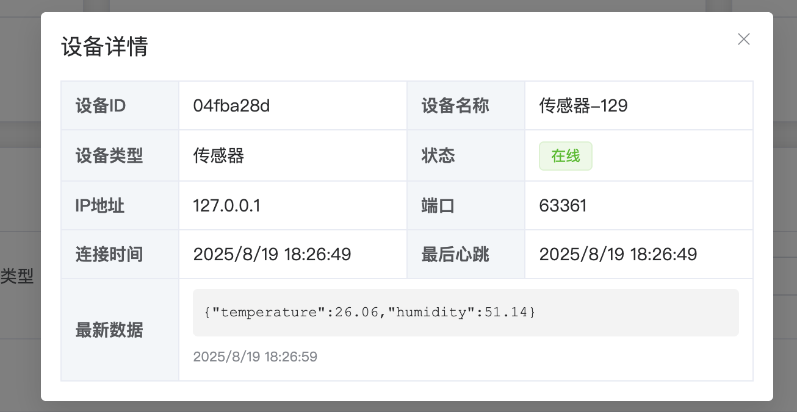

# IoT Device Management System

This is a complete IoT device management system built with Netty for high-performance servers, providing device connection management, real-time monitoring, status tracking, and more. The system includes a backend server and Vue3 frontend interface, perfect for beginners to learn! 🔥🔥🔥

## 🎯 Why Choose This Project?

**Real IoT device integration is expensive?** Don't worry! Our system provides complete virtual device simulators, allowing you to experience the full IoT development process without purchasing expensive hardware devices.

### 💡 Learning Advantages
- **Zero Hardware Cost**: Built-in device simulators, no need to purchase sensors, controllers, or other hardware
- **Ready to Use**: Complete system out of the box, quick start for IoT development
- **Real Experience**: Simulates real device connections, data reporting, status monitoring, and complete workflows
- **Progressive Learning**: From single devices to batch devices, gradually master IoT system architecture
- **Practical Project**: Complete production-level code, learn enterprise development best practices

## 🚀 Project Status

✅ **IoT Server**: Running normally (TCP:8888, WebSocket:8889)  
✅ **Frontend Interface**: Vue3 + Element Plus  
✅ **Device Simulator**: Supports multi-device concurrent testing  
✅ **Logging System**: Complete log recording and monitoring

### 📹 Device Batch Connection Demo


*1000 virtual devices connecting to server simultaneously, real-time display of device online status and data reporting*

### 📹 Device Offline Detection Demo


*Automatic device offline detection on heartbeat timeout, real-time device status updates and frontend interface refresh*

## 📸 Project Screenshots

### 🖥️ Main Interface Display


*Main dashboard interface - displays device statistics, real-time status, and paginated device list*

### 📊 Feature Demonstrations

| Feature | Screenshot | Description |
|---------|------------|-------------|
| Device Filtering |  | Support filtering devices by status, type, and name |
| Device Details |  | View detailed device information and latest data |
| Pagination Display |  | Support 10/20/50/100 records per page |
| Status Notifications |  | Real-time device online/offline notifications |
| Device Control |  | Batch device simulator control operations |

### 🔧 System Operation

| Component | Screenshot | Description |
|-----------|------------|-------------|
| Backend Server |  | Netty server running status |
| Batch Simulator |  | 1000 device concurrent testing |

## 📁 Project Structure

```
iot-device-manager/
├── backend/                   # Backend Java project
│   ├── src/main/java/com/michael/iot/
│   │   ├── server/                 # IoT device management system core modules
│   │   │   ├── DeviceInfo.java     # Device information entity class
│   │   │   ├── DeviceStatus.java   # Device status enumeration
│   │   │   ├── DeviceManager.java  # Device manager
│   │   │   ├── IoTNettyServer.java # IoT TCP server
│   │   │   ├── IoTDeviceHandler.java # Device handler
│   │   │   ├── WebSocketServer.java # WebSocket server
│   │   │   ├── WebSocketHandler.java # WebSocket handler
│   │   │   ├── DeviceStatusListener.java # Device status listener interface
│   │   │   ├── DeviceDataListener.java # Device data listener interface
│   │   │   └── IoTApplication.java # Application startup class
│   │   └── test/                   # Device simulator test modules
│   │       ├── IoTDeviceSimulator.java # Single device simulator
│   │       └── IoTDeviceBatchSimulator.java # Batch device simulator
│   ├── logs/                      # Log files
│   └── pom.xml                    # Maven configuration
├── frontend/                   # Vue3 frontend interface
│   ├── src/
│   │   ├── App.vue            # Main application component
│   │   └── main.js            # Application entry point
│   ├── package.json           # Frontend dependencies
│   └── vite.config.js         # Vite configuration
```

## 🏗️ Backend Code Architecture

### Core Module Structure

```
com.michael.iot.server/
├── Entity Classes
│   ├── DeviceInfo.java          # Device information entity
│   └── DeviceStatus.java        # Device status enumeration
├── Managers
│   └── DeviceManager.java       # Device manager
├── Servers
│   ├── IoTNettyServer.java      # TCP server
│   └── WebSocketServer.java     # WebSocket server
├── Handlers
│   ├── IoTDeviceHandler.java    # Device message handler
│   └── WebSocketHandler.java    # WebSocket message handler
├── Listeners
│   ├── DeviceStatusListener.java # Device status listener
│   └── DeviceDataListener.java   # Device data listener
└── Application Classes
    └── IoTApplication.java      # Application startup class
```

### Module Responsibility Description

#### 🔧 Core Components
- **DeviceInfo**: Device information entity class, containing device ID, name, type, status, and other attributes
- **DeviceStatus**: Device status enumeration, defining ONLINE, OFFLINE, and other statuses
- **DeviceManager**: Device manager, responsible for device registration, status management, heartbeat detection, and other core business logic

#### 🌐 Network Communication
- **IoTNettyServer**: Netty-based TCP server, handling IoT device connections
- **IoTDeviceHandler**: Device message handler, parsing and processing device registration, heartbeat, and data messages
- **WebSocketServer**: WebSocket server, pushing real-time data to frontend
- **WebSocketHandler**: WebSocket message handler, processing frontend requests

#### 📡 Event Listening
- **DeviceStatusListener**: Device status change listener interface
- **DeviceDataListener**: Device data update listener interface

#### 🚀 Application Startup
- **IoTApplication**: Application startup class, coordinating component startup and shutdown

#### 🧪 Testing Tools
- **IoTDeviceSimulator**: Single device simulator for testing individual device connections
- **IoTDeviceBatchSimulator**: Batch device simulator for stress testing and concurrent testing

## 🌟 IoT Device Management System

### Features

- **🔄 Device Connection Management**: Supports IoT devices connecting via TCP, automatically managing connection lifecycle
- **📊 Real-time Status Monitoring**: Real-time display of device online/offline status, supports status filtering
- **🔍 Device Filtering**: Supports filtering devices by status, type, name, and other dimensions
- **🔔 Real-time Notifications**: Real-time device online/offline notifications via WebSocket
- **💓 Heartbeat Detection**: Automatic device heartbeat detection, timeout auto-offline (60-second timeout)
- **📈 Data Reporting**: Supports device data reporting and receiving, real-time data display
- **📱 Responsive Interface**: Modern interface based on Vue3 and Element Plus
- **📝 Complete Logging**: Detailed device operation log recording

### 🚀 Quick Start

#### 1. Environment Setup

##### Backend Environment
- Java 11+
- Maven 3.6+

##### Frontend Environment
- Node.js 16+
- npm 8+

#### 2. Start Backend Server

```bash
# Compile project
cd backend 
mvn clean compile

# Start IoT server (TCP port 8888, WebSocket port 8889)
mvn compile && java -cp "target/classes:$(mvn dependency:build-classpath -Dmdep.outputFile=/dev/stdout -q)" com.michael.iot.server.IoTApplication 8888 8889
```

**Success indicators**:
- TCP server listening on port 8888
- WebSocket server listening on port 8889
- Logs show "IoT TCP server started successfully" and "WebSocket server started successfully"

#### 3. Start Frontend Interface

```bash
# Enter frontend directory
cd frontend

# Install dependencies
npm install

# Start development server
npm run dev
```

Frontend interface will start at http://localhost:3000.

#### 4. Test Device Connections

Use device simulator for testing:

```bash
# Compile and run single device simulator
cd backend && mvn compile && java -cp "target/classes:$(mvn dependency:build-classpath -Dmdep.outputFile=/dev/stdout -q)" com.michael.iot.test.IoTDeviceSimulator localhost 8888 "Temperature Sensor" "Sensor"
```

### 📡 Device Communication Protocol

#### Device Registration
```
REGISTER|DeviceID|DeviceName|DeviceType
```
Example: `REGISTER|fb0c4407|Temperature Sensor 1|Sensor1`

#### Heartbeat Message
```
HEARTBEAT|DeviceID
```
Example: `HEARTBEAT|fb0c4407`

#### Data Reporting
```
DATA|DataContent
```
Example: `DATA|{"temperature":28.64,"humidity":48.41}`

### 📄 Pagination Features

Device list supports pagination display, providing better user experience:

#### Pagination Features
- **Default Settings**: Display 10 records per page
- **Page Size**: Support 10, 20, 50, 100 records per page
- **Smart Navigation**: Support previous page, next page, jump to specified page
- **Total Display**: Show total number of devices after filtering
- **Auto Reset**: Automatically return to first page when filtering or resetting

#### Pagination Component Functions
- **Total Display**: Show total number of devices under current filter conditions
- **Page Size Selector**: Choose number of records displayed per page
- **Pagination Navigation**: Previous page, next page buttons
- **Page Number Display**: Show current page number and total pages
- **Jump Function**: Directly jump to specified page

### 🎨 Frontend Features

- **📊 Device Statistics**: Display total devices, online count, offline count
- **🔍 Device Filtering**: Support filtering by status, type, name
- **📄 Pagination Display**: Device list pagination, support 10/20/50/100 records per page
- **⚡ Real-time Updates**: WebSocket real-time device status changes
- **📋 Device Details**: View detailed device information (ID, name, type, IP, connection time, etc.)
- **🔔 Status Notifications**: Real-time device online/offline notifications
- **📈 Data Display**: Real-time display of sensor data reported by devices

### 🛠️ Technology Stack

#### Backend
- **Netty 4.1.94**: High-performance network framework
- **Java 11**: Primary development language
- **Maven**: Project build tool
- **SLF4J + Logback**: Logging framework
- **WebSocket**: Real-time communication protocol

#### Frontend
- **Vue 3**: Modern frontend framework
- **Element Plus**: Enterprise-level UI component library
- **WebSocket**: Real-time communication
- **Vite**: Fast build tool

## ⚙️ Configuration

### Port Configuration
- TCP server default port: 8888
- WebSocket server default port: 8889
- Frontend development server port: 3000

### Heartbeat Configuration
- Heartbeat timeout: 60 seconds
- Heartbeat send interval: 30 seconds
- Data report interval: 60 seconds

### Logging Configuration
- Log file: `backend/logs/iot-device-manager.log`
- Log level: INFO
- Log format: Timestamp + Thread + Level + Class Name + Message

## 🔧 Development Guide

### Adding New Device Types
1. Add device type in `DeviceInfo.java`
2. Update device type options in frontend `App.vue`
3. Add corresponding simulation logic in device simulator

### Feature Extensions
- Device command sending
- Device data storage (database integration)
- Device group management
- Alert rule configuration
- Historical data query
- Device firmware upgrade
- User permission management

## 🚨 Troubleshooting

### Common Issues

1. **Port Occupied**
   ```bash
   # Check port usage
   lsof -i :8888 -i :8889
   
   # Modify port numbers in startup script
   # or stop processes occupying ports
   ```

2. **WebSocket Connection Failed**
   - Check if WebSocket server is started
   - Check firewall settings
   - Confirm port 8889 is open

3. **Device Connection Failed**
   - Check if TCP server is started
   - Confirm port 8888 is open
   - Check network connection

4. **Frontend Cannot Access**
   - Confirm frontend server is started
   - Check if port 3000 is occupied
   - View browser console error messages

5. **Missing Dependencies**
   ```bash
   # Recompile and download dependencies
   mvn clean compile
   
   # Check classpath settings
   mvn dependency:build-classpath
   ```

### View Logs
   ```bash
  # View server logs
  tail -f backend/logs/iot-device-manager.log

  # View frontend logs
  cd frontend && npm run dev
   ```

### System Monitoring
```bash
# Check process status
ps aux | grep java

# Check port listening
netstat -an | grep 8888
netstat -an | grep 8889

# Check memory usage
jstat -gc <pid>
```

## 📈 Project Highlights

- **High Performance**: High-concurrency processing capability based on Netty
- **Real-time**: WebSocket real-time communication, millisecond-level response
- **Extensible**: Modular design, easy to extend new features
- **User-friendly**: Complete startup scripts and testing tools
- **Monitorable**: Detailed log recording and performance monitoring
- **Modern**: Modern interface with Vue3 + Element Plus

## 🤝 Contributing

1. Fork the project
2. Create a feature branch (`git checkout -b feature/AmazingFeature`)
3. Commit your changes (`git commit -m 'Add some AmazingFeature'`)
4. Push to the branch (`git push origin feature/AmazingFeature`)
5. Open a Pull Request

## 📄 License

This project is licensed under the MIT License - see the [LICENSE](LICENSE) file for details.

## 📞 Contact

For questions or suggestions, please contact us through:
- Submit an Issue
- Send an email
- Project discussion area
